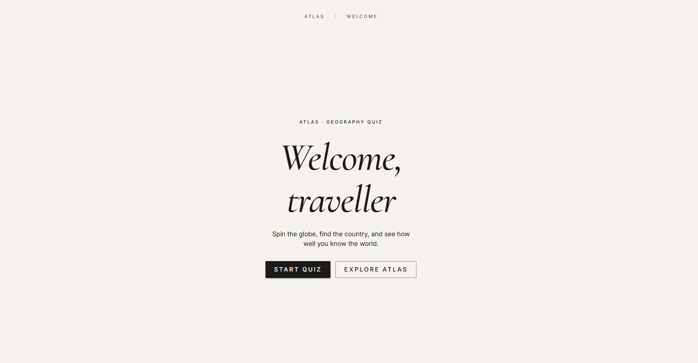
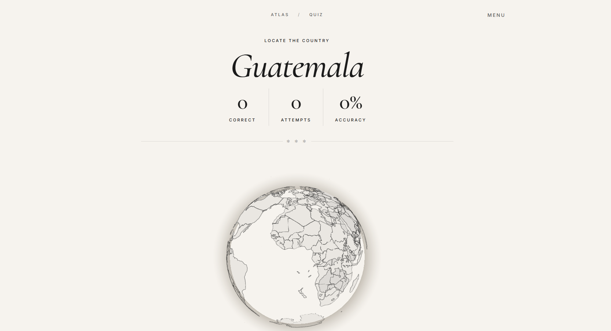

# Geography Quiz

An interactive 3D globe quiz where you locate countries by clicking on a rotating Earth.

**Live demo:** [atlas-pin.vercel.app](https://atlas-pin.vercel.app/)

## Screenshots

| Intro screen | Quiz mode |
| :---: | :---: |
|  |  |

## What it does

- **Quiz mode** — choose 5, 10, 20, or unlimited rounds. A country name appears at the top; click its outline on the globe to answer. Correct clicks shade the country green, wrong clicks shade it red, and the next question follows after a short pause.
- **Atlas mode** — free exploration. Click any country to open an info card with its flag, capital, region, population, area, languages, and currencies. Click again to smoothly zoom into the capital.
- **Score summary** — end-of-quiz card with accuracy percentage and a verdict message based on performance.
- **Responsive and accessible** — fluid typography, keyboard-friendly controls, ARIA live regions for screen readers, and `prefers-reduced-motion` respected globally.

## Tech stack

| Layer | Choice |
| --- | --- |
| Framework | React 18 + TypeScript 5 (strict) |
| Build tool | Vite 5 |
| Routing | React Router v7 |
| 3D globe | [react-globe.gl](https://github.com/vasturiano/react-globe.gl) |
| UI library | MUI v9 + Emotion |
| Styling | CSS Modules (scoped per component) |
| Typography | `@fontsource/inter`, `@fontsource/cormorant-garamond` |
| Data | Public GeoJSON + [REST Countries](https://restcountries.com/) API |

No global state library — local state is enough thanks to a small set of focused custom hooks.

## Getting started

```bash
git clone https://github.com/ionitarobert/geography-quiz.git
cd geography-quiz
npm install
npm run dev
```

The dev server runs at `http://localhost:5173`. Other scripts:

- `npm run build` — production bundle into `dist/`
- `npm run preview` — serve the built bundle locally
- `npm run lint` — run ESLint

## Project structure

```
src/
├── components/      # Page and UI components, each paired with a CSS module
│   ├── Atlas/       # Exploration mode (globe + country info card)
│   ├── HeaderBar/   # Persistent top nav with route-specific actions
│   ├── Intro/       # Landing page
│   ├── Layout/      # Router outlet wrapper
│   ├── Quiz/        # Gameplay screen
│   ├── Result/      # Score summary
│   └── Selection/   # Difficulty picker
├── hooks/
│   ├── useQuiz.ts          # Quiz state machine (targets, scoring, feedback)
│   ├── useCountries.ts     # Loads GeoJSON country features
│   └── useCountryInfo.ts   # Fetches country metadata
├── utils/
│   ├── accuracy.ts         # Score percentage + verdict messaging
│   └── countryMatch.ts     # Country name matching
├── types/index.ts          # Shared types (CountryFeature, QuestionLimit, ...)
├── theme.ts                # MUI theme (warm cream/brown palette)
├── router.tsx              # Route definitions
└── main.tsx                # App entry point
```

## Routes

| Path | Component | Purpose |
| --- | --- | --- |
| `/` | `Intro` | Landing screen, links to quiz or atlas |
| `/select` | `Selection` | Pick difficulty (5 / 10 / 20 / unlimited) |
| `/quiz/:limit?` | `Quiz` | Gameplay; invalid `limit` redirects to `/select` |
| `/result` | `Result` | Score summary (reads navigation state) |
| `/atlas` | `Atlas` | Free exploration with country info card |
| `*` | — | Fallback redirect to `/` |

## Architecture notes

A few things worth pointing out for anyone reading the source:

- **State lives in custom hooks.** `useQuiz` encapsulates target selection, scoring, feedback timing, and uses a `useRef` history to avoid repeating recent countries. No Redux or Zustand — the app stays light.
- **Layout via Router outlet.** A single `Layout` component wraps every route and renders a persistent `HeaderBar` whose actions adapt to the current path.
- **Smooth globe transitions.** Camera moves use a 1200 ms ease with distinct altitudes for country framing (`1.6`) and capital framing (`0.65`) in atlas mode.
- **Type-safe throughout.** Shared types — `CountryFeature`, `CountryInfo`, `QuestionLimit`, `Feedback` — live in `src/types/index.ts` and flow through every component.
- **Accessibility baked in.** Quiz feedback uses ARIA live regions, toggle controls respond to Enter/Space, and the global stylesheet honours `prefers-reduced-motion`.
- **Fluid responsive design.** `clamp()` typography, CSS Grid layouts that reflow from 2 to 4 columns, and a `ResizeObserver` keeps the globe sized to its container.

## Author

Built by [Robert Ionita](https://github.com/ionitarobert).

## License

MIT
